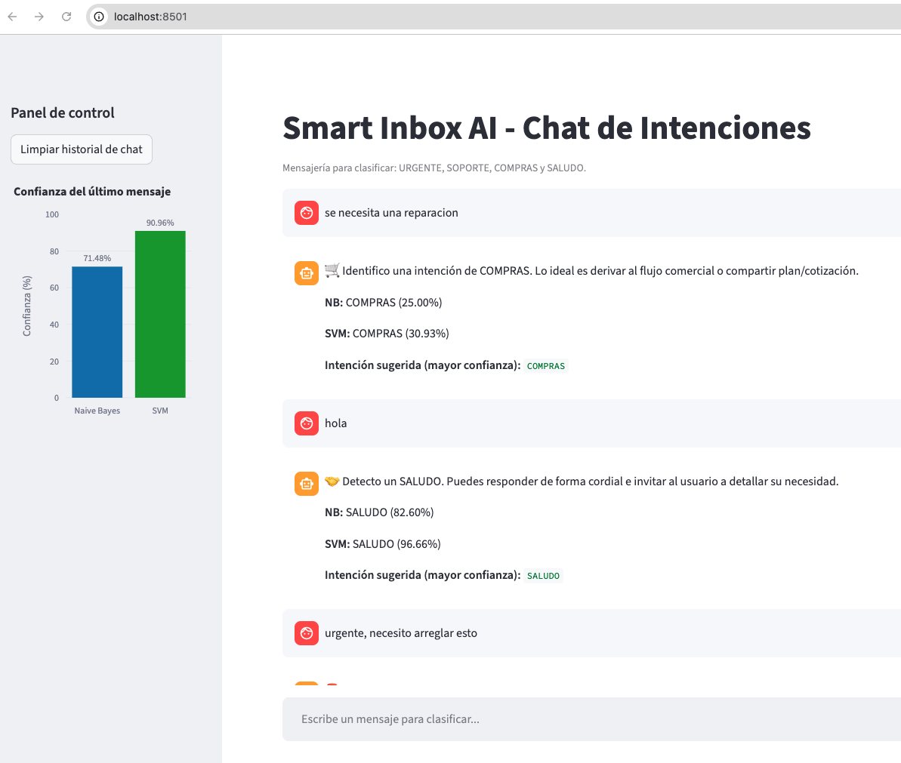

# Smart Inbox AI - Clasificador de Intenciones

Proyecto de portafolio para clasificar mensajes en 4 intenciones:

- `URGENTE`
- `SOPORTE`
- `COMPRAS`
- `SALUDO`

Incluye:
- un notebook de experimentación (`research/`)
- una app local full-stack (`smart-inbox-ai/`) con backend FastAPI y frontend Streamlit.

## Demo

<p align="center">
  
</p>

<p align="center">
  Interfaz principal del clasificador mostrando predicciones de intención y nivel de confianza por modelo.
</p>

## Estructura del proyecto

```text
PROY_CLASIFICADOR_INTENCIONES/
├── research/
│   └── model_experimentation.ipynb
├── smart-inbox-ai/
│   ├── backend/
│   │   ├── main.py
│   │   ├── ml_utils.py
│   │   ├── train_models.py
│   │   └── models/              # generado localmente (.pkl)
│   ├── frontend/
│   │   └── app.py
│   ├── requirements.txt
│   └── .env.example
├── setup_env.sh
└── .gitignore
```

## Requisitos

- Python 3.11+
- macOS / Linux / Windows (con equivalentes de comandos)

## 1) Preparar entorno

Desde la raíz del repositorio:

```bash
python3 -m venv venv
source venv/bin/activate
pip install --upgrade pip
pip install -r smart-inbox-ai/requirements.txt
```

> Opcional: también puedes usar `bash setup_env.sh` para instalar dependencias de notebook.

## 2) Generar modelos (artefactos .pkl)

```bash
cd smart-inbox-ai
python backend/train_models.py
```

Se crearán:
- `smart-inbox-ai/backend/models/nb_model.pkl`
- `smart-inbox-ai/backend/models/svm_model.pkl`
- `smart-inbox-ai/backend/models/vectorizer.pkl`

## 3) Ejecutar backend (FastAPI)

En una terminal:

```bash
source venv/bin/activate
cd smart-inbox-ai/backend
python -m uvicorn main:app --reload --host 0.0.0.0 --port 8000
```

Verificación:
- Docs: [http://localhost:8000/docs](http://localhost:8000/docs)
- Health: [http://localhost:8000/health](http://localhost:8000/health)

## 4) Ejecutar frontend (Streamlit)

En otra terminal:

```bash
source venv/bin/activate
cd smart-inbox-ai/frontend
streamlit run app.py
```

Abrir en navegador:
- [http://localhost:8501](http://localhost:8501)

## Configuración por variables de entorno

El frontend permite configurar el endpoint del backend:

```bash
export BACKEND_PREDICT_URL=http://localhost:8000/predict
```

Referencia: `smart-inbox-ai/.env.example`.

## Probar API rápidamente

```bash
curl -X POST "http://localhost:8000/predict" \
  -H "Content-Type: application/json" \
  -d '{"text":"Hola, necesito saber el precio del soporte urgente"}'
```


## Notas

- Los modelos `.pkl` están ignorados por `.gitignore` para evitar subir binarios generados localmente.
- Si clonas el repositorio en otra máquina, ejecuta de nuevo `python backend/train_models.py`.
